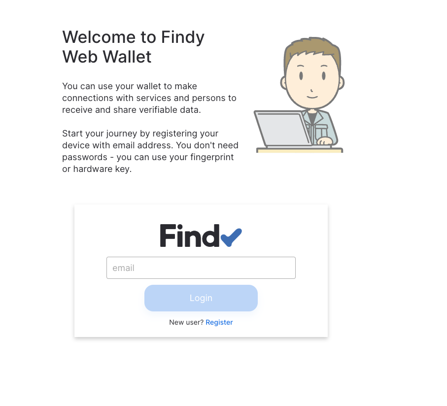

# Findy Agency deployment to AWS ECS

This cdk script sets up agency to AWS:

- microservice backend auth, vault, core to ECS with load balancer
- pwa wallet app to s3
- cloudfront as proxy to redirect requests from public internet to s3 or load balancer
- pipeline to update agency deployment on new releases to agency services


**Assumptions:**

- steward seed and DID is known (if using indy ledger)
- genesis-file is available (if using indy ledger)
- AWS Route53 managed zone

Note! This setup is intended for development time testing scenarios.
Production setup would need another iteration with additional security,
high availability and performance considerations in mind. There are some open
issues with this setup (see TODO), and most probably those issues will not be
solved as the direction for future solutions will be more platform-agnostic.

## Prerequisities

**Note that the none of the following steps are optional.**

1. Clone this repository to your own desktop.
The initial [CDK pipeline](https://docs.aws.amazon.com/cdk/v2/guide/cdk_pipeline.html)
creation is done from your local computer according to these instructions.
After the creation, the pipeline automatically reconfigures itself to deploy new stages or stacks.

1. `cd` to this folder: `cd aws-ecs`

1. Make sure you have installed [AWS CLI](https://aws.amazon.com/cli/),
Docker, node.js, AWS CDK, and Typescript:

   ```bash
   # node
   nvm install

   # aws cdk
   npm install -g aws-cdk

   # typescript
   npm install -g typescript
   ```

1. You need AWS Account. Create IAM user with full AWS access rights,
and [copy the AWS Access keys via console](https://docs.aws.amazon.com/IAM/latest/UserGuide/id_credentials_access-keys.html)
if you don't have them already.

1. [Create a public hosted zone to AWS Route53](https://docs.aws.amazon.com/Route53/latest/DeveloperGuide/CreatingHostedZone.html)
for your domain. If your domain registrar is different from AWS Route53,
you need to store the AWS nameservers to your domain settings
(via the domain registrar UI).

1. [Create GitHub codestar connection](https://docs.aws.amazon.com/dtconsole/latest/userguide/connections-create-github.html)
so that the pipeline can clone the needed source code repositories and trigger automatic version updates.
The connection is not used to access your repositories, only the public Findy Agency repositories,
so you can for example create a dummy repository for it (if you don't want to allow full access).

1. Declare following environment variables:

   ```bash
   # default region for AWS e.g. eu-north-1
   export AWS_DEFAULT_REGION=<xxx>

   # IAM user access key ID
   export AWS_ACCESS_KEY_ID=<xxx>

   # IAM user secret access key
   export AWS_SECRET_ACCESS_KEY=<xxx>

   # default region for AWS e.g. eu-north-1
   export CDK_DEFAULT_REGION=<xxx>

   # AWS account number
   export CDK_DEFAULT_ACCOUNT=<xxx>

   # domain root (AWS Route53 zone created in previous step)
   export DOMAIN_NAME="example.com"

   # desired pwa wallet domain
   export SUB_DOMAIN_NAME="agency"

   # desired agency api domain
   export API_SUB_DOMAIN_NAME="agency-api"

   # github connection arn
   export GITHUB_CONNECTION_ARN="arn:aws:codestar-connections:us-east-1:xxx:connection/xxx"

   # steward DID registered to ledger
   # (empty string if not running as steward,
   # e.g. "Th7MpTaRZVRYnPiabds81Y" when using file ledger)
   export STEWARD_DID="xxx"

   # steward seed used when registering steward DID to ledger
   # (empty string if not running as steward,
   # e.g. "000000000000000000000000Steward1" when using file ledger)
   export STEWARD_SEED="xxx"

   # steward wallet key
   # note: agency core can be used to create compatible keys: findy-agent tools key create
   # (empty string if not running as steward)
   export STEWARD_WALLET_KEY="xxx"

   # desired agency admin id
   export ADMIN_ID="xxx"

   # desired agency admin authenticator key
   # note: agency cli can be used to create compatible keys: findy-agent-cli new-key
   export ADMIN_AUTHN_KEY="xxx"
   ```

1. Make sure you know the path to ledger genesis file (if not using file ledger).

## Steps

```bash
# install deps
npm install

# save pipeline params
# leave <path_to_ledger_genesis> empty if using file ledger
./tools/init.sh <path_to_ledger_genesis>

# bootstrap, first synth and store context to AWS params
cdk bootstrap
cdk synth
npm run pipeline:context

# save secrets
./tools/store-secrets.sh

# deploy the pipeline
cdk deploy
```

Open pipelines at AWS console and see that the pipeline succeeds. Following changes
to the app or infra are deployed automatically by the pipeline.

## Testing

Navigate to URL <https://your-sub-domain-name.your-domain-name>

You should see the view below. Test the user registration and login according to [these instructions](https://github.com/findy-network/findy-wallet-pwa#registerlogin).


**TODO:**

- disabling default HTTP listener
- auth/core services lock bolt dbs while execution and thus
updates bring currently the whole system down
- load balancer has performance issues with GRPC-listener TLS termination
